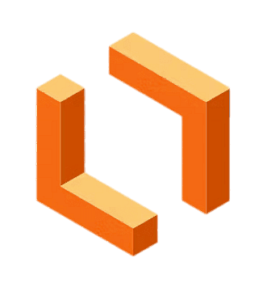

# Ferramentas Utilizadas

## Função dos Autores

    <b>Tabela 1:</b> Funções dos autores

| Nome | Função |
|------|--------|
|[Amanda Cruz](https://github.com/mandicrz)| Criação do documento; Adição do conteúdo da página |
|[João Pedro](https://github.com/johnaopedro)| Revisão geral do documento |

    Autor(es): 
    <a href="https://github.com/mandicrz" target="_blank">Amanda Cruz</a> 

## Introdução

Este documento apresenta as **ferramentas utilizadas** durante todo o desenvolvimento do projeto de Requisitos de Software referente ao aplicativo Cadastro Único. As ferramentas foram aplicadas em diversas etapas do processo. A seleção das ferramentas teve como base a acessibilidade, colaboração em grupo e aderência aos objetivos de cada fase do projeto.

## Ferramentas

A Tabela 2 a seguir apresenta as ferramentas organizadas por **propósito** e **etapa** correspondente.

    <b>Tabela 2:</b> Ferramentas Utilizadas

| Logo | Ferramenta | Propósito | Etapa(s) |
|:----:|:-----------:|:---------:|:--------:|
|  | [Microsoft Teams](https://www.microsoft.com/pt-br/microsoft-teams) | Realização de reuniões, videochamadas e gravações | Todas |
|  | [Telegram](https://telegram.org/) | Comunicação com professor, monitores e organização de tarefas | Todas |
|  | [GitHub](https://github.com/) | Armazenamento, versionamento e documentação dos artefatos | Todas |
|  | [VSCode](https://code.visualstudio.com/) | Desenvolvimento e edição colaborativa de código | Todas |
|  | [Git](https://git-scm.com/) | Controle de versões local e integração com o GitHub | Todas |
|  | [Aprender 3](https://aprender3.unb.br/) | Acesso a materiais do projeto e comunicação | Todas |
|  | [Google Docs](https://docs.google.com/) | Edição colaborativa de documentos e relatórios | Todas |
|  | [YouTube](https://www.youtube.com/) | Publicação de vídeos explicativos e apresentações | Todas |
|  | [WhatsApp](https://www.whatsapp.com/) | Comunicação informal e rápida entre membros | Todas |
|  | [MkDocs](https://www.mkdocs.org/) | Geração de páginas web para artefatos | Todas |
|  | [ChatGPT](https://openai.com/chatgpt) | Apoio em revisão técnica e explicações de conteúdo | Todas |
|  | [Google Chrome](https://www.google.com/chrome/) | Acesso à documentação e uso de ferramentas web | Todas |
|  | [Google Sheets](https://www.google.com/sheets/about/) | Elaboração e análise do heatmap | Etapa 1 |
|  | [Draw.io](https://www.diagrams.net/) | Criação de Rich Pictures, fluxogramas e diagramas | Etapas 1 e 4 |
|  | [Krita](https://krita.org/) | Ilustração manual do Rich Picture | Etapa 1 |
|  | [Google Forms](https://www.google.com/forms/about/) | Aplicação de formulários para elicitação de requisitos | Etapa 2 |
|  | [This Person Does Not Exist](https://thispersondoesnotexist.com/) | Geração de imagens fictícias para construção de personas | Etapa 2 |
|  | [Lucidchart](https://www.lucidchart.com/) | Modelagem UML (casos de uso, diagramas de classes, etc.) | Etapa 3 |
|  | [Figma](https://www.figma.com/) | Elaboração de protótipos de alta fidelidade | Etapa 5 |

    Autor(es): 
    <a href="https://github.com/mandicrz" target="_blank">Amanda Cruz, 2025</a> 

---

## Conclusão

O uso das ferramentas apresentadas neste documento contribuiu significativamente para a organização, comunicação, modelagem e prototipação do projeto de requisitos. A diversidade de ferramentas permitiu uma abordagem integrada e colaborativa, facilitando o desenvolvimento dos artefatos e a construção de um produto final coerente com as necessidades levantadas.

## Referências

> Microsoft Teams. Disponível em: [https://www.microsoft.com/pt-br/microsoft-teams](https://www.microsoft.com/pt-br/microsoft-teams). Acesso em: 07 de Jul. de 2025. 

> Telegram. Disponível em: [https://telegram.org/](https://telegram.org/). Acesso em: 07 de Jul. de 2025.

> GitHub. Disponível em: [https://github.com/](https://github.com/). Acesso em: 07 de Jul. de 2025.

> VSCode. Disponível em: [https://code.visualstudio.com/](https://code.visualstudio.com/). Acesso em: 07 de Jul. de 2025.

> Git. Disponível em: [https://git-scm.com/](https://git-scm.com/). Acesso em: 07 de Jul. de 2025.

> Aprender3. Disponível em: [https://aprender3.unb.br/](https://aprender3.unb.br/). Acesso em: 07 de Jul. de 2025.

> Google Docs. Disponível em: [https://docs.google.com/](https://docs.google.com/). Acesso em: 07 de Jul. de 2025.

> YouTube. Disponível em: [https://www.youtube.com/](https://www.youtube.com/). Acesso em: 07 de Jul. de 2025.

> WhatsApp. Disponível em: [https://www.whatsapp.com/](https://www.whatsapp.com/). Acesso em: 07 de Jul. de 2025.

> MkDocs. Disponível em: [https://www.mkdocs.org/](https://www.mkdocs.org/). Acesso em: 07 de Jul. de 2025.

> ChatGPT. Disponível em: [https://openai.com/chatgpt](https://openai.com/chatgpt). Acesso em: 07 de Jul. de 2025.

> Google Sheets. Disponível em: [https://www.google.com/sheets/about/](https://www.google.com/sheets/about/). Acesso em: 07 de Jul. de 2025.

> Draw.io. Disponível em: [https://www.diagrams.net/](https://www.diagrams.net/). Acesso em: 07 de Jul. de 2025.

> Krita. Disponível em: [https://krita.org/](https://krita.org/). Acesso em: 07 de Jul. de 2025.

> Google Forms. Disponível em: [https://www.google.com/forms/about/](https://www.google.com/forms/about/). Acesso em: 07 de Jul. de 2025.

> This Person Does Not Exist. Disponível em: [https://thispersondoesnotexist.com/](https://thispersondoesnotexist.com/). Acesso em: 07 de Jul. de 2025.

> Lucidchart. Disponível em: [https://www.lucidchart.com/](https://www.lucidchart.com/). Acesso em: 07 de Jul. de 2025.

> Figma. Disponível em: [https://www.figma.com/](https://www.figma.com/). Acesso em: 07 de Jul. de 2025.

## Histórico de Versão

| Versão |    Data    |    Descrição     |         Autor         |       Revisor      |
| :----: | :--------: | :--------------: | :-------------------: | :----------------: |
|  1.0   | 07/07/2025 | Desenvolvimento do conteúdo da página| [Amanda Cruz](https://github.com/mandicrz) | [João Pedro Costa](https://github.com/johnaopedro) |

