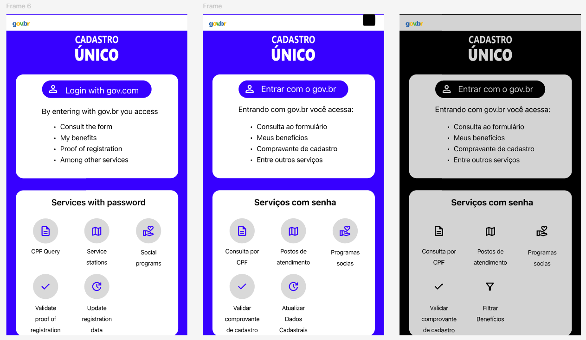

# Protótipo

## Função dos autores
| Nome                                               | Função                                                            | 
|----------------------                              |----------------------------------------------------------------   |
|[Julia Gabriela](https://github.com/JuliaGabP)      | Criação do documento; Protótipo (Modo escuro; Adição de outros idiomas) | 
|[Ryan Salles](https://github.com/RA-Salles)         | Revisão geral| 

    Autor(es): 
    <a href="https://github.com/JuliaGabP" target="_blank">Julia Gabriela</a>

## Introdução
A prototipagem é uma técnica utilizada no processo de engenharia de requisitos e design de sistemas para representar, de forma visual e/ou funcional, aspectos de um sistema antes de sua implementação completa. De acordo com Bruton (UX Design Institute), o protótipo atua como um artefato intermediário entre a especificação de requisitos e o desenvolvimento, permitindo validar funcionalidades, fluxos de interação e regras de negócio com os stakeholders. Já Boicheva (2024) reforça que a prototipagem é essencial para detectar inconsistências, ambiguidade e requisitos incompletos, antecipando problemas que poderiam surgir nas fases posteriores do ciclo de vida do software.

## Tipos
Os principais tipos de protótipos são classificados de acordo com o seu nível de fidelidade e interatividade:  
**Protótipos de baixa fidelidade:** são representações simplificadas, como desenhos em papel, focadas na estrutura e navegação. Não apresentam lógica de negócio nem interações reais, sendo úteis nas etapas iniciais de elicitação e validação de requisitos.  
**Protótipos de média fidelidade:** incluem elementos gráficos mais definidos e alguma interatividade simulada. São usados para revisar a experiência do usuário, fluxo de tarefas e regras básicas de navegação.  
**Protótipos de alta fidelidade:** são quase funcionais, com interfaces próximas da versão final e comportamentos interativos, simulando o funcionamento real do sistema. Servem para validação precisa de requisitos funcionais e não funcionais, testes com usuários e até como referências para desenvolvedores.  
A escolha do tipo de protótipo depende do objetivo da prototipagem, da fase do projeto e do nível de maturidade dos requisitos. Em contextos de engenharia de software, a prototipagem contribui diretamente para a redução de retrabalho, melhora da comunicação entre equipes técnicas e usuários, e aumento da qualidade dos requisitos especificados.  

## Protótipo 1
**Autora:** Julia Gabriela.  
**Funcionalidade:** Modo escuro; Adição de outros idiomas.  
**Rastreabilidade:** [RF38](../../elicitacao/requisitos_elicitados.md) [RF39](../../elicitacao/requisitos_elicitados.md)   
**Ferramentas:** Figma.  
**Tipo:** Alta Fidelidade.  
**Telas da prototipagem**

    

**Link** para acesso [clique aqui](https://www.figma.com/design/UEcxBHjeqzLTmSWEwXQN2T/Sem-t%C3%ADtulo?node-id=0-1&p=f&t=xMxhNQEYE3KTzV0o-0)

## Validação

Foram realizadas as validações dos protótipos com os usuários.

### Validação II: Protótipo 1
A validação do prototipo 1 foi realizada com a usuária Dara Maria, que é a Project Owner do projeto. A validação ocorreu presencialmente, onde foram discutidos os pontos fortes e as sugestões de melhorias para o protótipo. Abaixo estão as informações da entrevista e os participantes.

    <b> Tabela 1:</b> Informações da Entrevista

| Campo   | Informação                                               |
| :-----: | :------------------------------------------------------: |
| Local   | Ailab                                                    |
| Data    | 01/06/2025                                               |
| Horário | 10:00                                                    |
| Duração | Cerca de 2 minutos                                       |

    <b>Autor(es)</b><a href="https://github.com/RA-Salles" target="_blank">Ryan Salles</a>

    <b> Tabela 2:</b> Participantes da Entrevista

| Nome                                                | Função                      |
| :------------------------------------------:        | :----------------------:    |
| Dara Maria                                          | Usuário/ Project Owner      |
| [Julia Gabriela](https://github.com/JuliaGabP)      | Entrevistador/Desenvolvedor |

    <b>Autor(es)</b><a href="https://github.com/RA-Salles" target="_blank">Ryan Salles</a>

<iframe width="560" height="315" src="https://www.youtube.com/embed/TGWco6sPpew?si=3H2EKWFHaIVfpj_i" title="YouTube video player" frameborder="0" allow="accelerometer; autoplay; clipboard-write; encrypted-media; gyroscope; picture-in-picture; web-share" referrerpolicy="strict-origin-when-cross-origin" allowfullscreen></iframe>

## Bibliografia
BRUTON, L. A complete guide to prototyping - UX Design Institute. Disponível em: <https://www.uxdesigninstitute.com/blog/prototyping-guide/>.

    

BOICHEVA, S. What is Prototype Design? [Guide 2024]. Disponível em: <https://htmlburger.com/blog/prototype-design/>.

    

## Histórico de versão
| Versão |    Data    |    Descrição                                       |         Autor                                      |       Revisor                                      |
| :----: | :--------: | :--------------:                                   | :-------------------:                              | :----------------:                                 |
|  1.0   | 01/07/2025 | Desenvolvimento do modelo de documento             | [João Pedro Costa](https://github.com/johnaopedro) | [Ryan Salles](https://github.com/RA-Salles)        |
|  1.1   | 06/07/2025 | Modificação do modelo para uso com outro protótipo | [Julia Gabriela](https://github.com/JuliaGabP)        | [João Pedro Costa](https://github.com/johnaopedro) |

