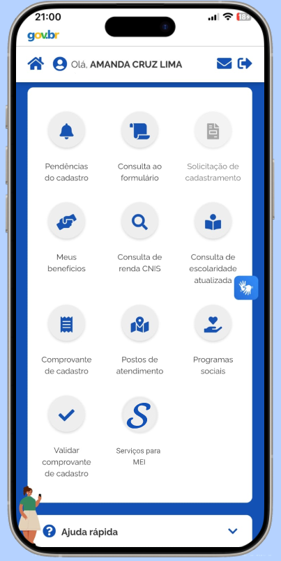
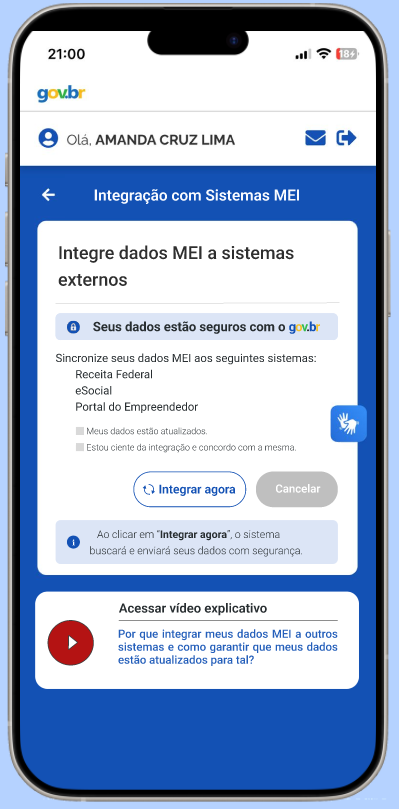
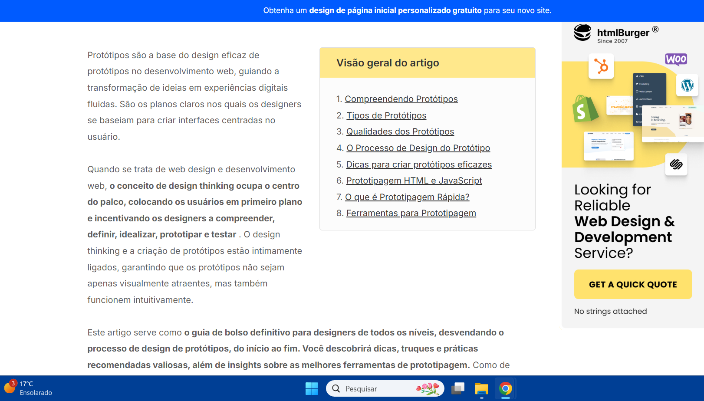

# Protótipo — Upload de documentos e Notificação de pendências ou atualizações

## Função dos autores

    <b>Tabela 1:</b> Função dos Autores

| Nome                                               | Função                                                                                  | 
|----------------------------------------------------|-----------------------------------------------------------------------------------------|
|[Amanda Cruz](https://github.com/mandicrz)          | Criação dos protótipos Integração MEI e Vídeos Explicativos                             | 
|[Ryan Salles](https://github.com/RA-Salles)         | Revisão geral                                                                           | 

    Autor(es): 
    <a href="https://github.com/mandicrz" target="_blank">Amanda Cruz</a>

## Introdução

A prototipagem é uma técnica utilizada no processo de engenharia de requisitos e design de sistemas para representar, de forma visual e/ou funcional, aspectos de um sistema antes de sua implementação completa. De acordo com Bruton (UX Design Institute), o protótipo atua como um artefato intermediário entre a especificação de requisitos e o desenvolvimento, permitindo validar funcionalidades, fluxos de interação e regras de negócio com os stakeholders. Já Boicheva (2024) reforça que a prototipagem é essencial para detectar inconsistências, ambiguidade e requisitos incompletos, antecipando problemas que poderiam surgir nas fases posteriores do ciclo de vida do software.

## Tipos

Os principais tipos de protótipos são classificados de acordo com o seu nível de fidelidade e interatividade:  

**Protótipos de baixa fidelidade:** são representações simplificadas, como desenhos em papel, focadas na estrutura e navegação. Não apresentam lógica de negócio nem interações reais, sendo úteis nas etapas iniciais de elicitação e validação de requisitos.  

**Protótipos de média fidelidade:** incluem elementos gráficos mais definidos e alguma interatividade simulada. São usados para revisar a experiência do usuário, fluxo de tarefas e regras básicas de navegação.  

**Protótipos de alta fidelidade:** são quase funcionais, com interfaces próximas da versão final e comportamentos interativos, simulando o funcionamento real do sistema. Servem para validação precisa de requisitos funcionais e não funcionais, testes com usuários e até como referências para desenvolvedores.  
A escolha do tipo de protótipo depende do objetivo da prototipagem, da fase do projeto e do nível de maturidade dos requisitos. Em contextos de engenharia de software, a prototipagem contribui diretamente para a redução de retrabalho, melhora da comunicação entre equipes técnicas e usuários, e aumento da qualidade dos requisitos especificados.

## Telas do Protótipo

### Descrição das Telas

#### 1. Tela Inicial
A tela inicial apresenta ao usuário as principais opções do sistema de forma clara e objetiva.

#### 2. Tela de Integração MEI com vídeos explicativos
Esta tela permite ao usuário MEI a opção de integrar seus dados a sistemas externos, como Receita Federal, eSocial e Portal do Empreendedor. Os componentes são:

- **Texto explicativo principal:** orienta o usuário sobre a integração dos dados MEI com os sistemas externos.
- **Selo de segurança:** mensagem “Seus dados estão seguros com o gov.br” com ícone de cadeado.
- **Lista dos sistemas integráveis:**
    - Receita Federal  
    - eSocial  
    - Portal do Empreendedor
- **Checkbox "Meus dados estão atualizados":** campo obrigatório que confirma que os dados do usuário estão atualizados.
- **Checkbox "Estou ciente da integração e concordo com a mesma.":** campo obrigatório para prosseguir com a integração.
- **Botão "Integrar agora":** ativa o processo de integração dos dados, desde que os checkboxes estejam marcados.
- **Botão "Cancelar":** cancela o processo de integração.
- **Mensagem de aviso:** informa que ao clicar em “Integrar agora”, o sistema buscará e enviará os dados com segurança.
- **Botão "<-" (voltar):** retorna à tela inicial do aplicativo.
- **Seção de ajuda multimídia:** direciona para um vídeo explicativo sobre o processo de integração.

Essas telas foram projetadas para garantir uma navegação intuitiva e facilitar o acesso às principais funcionalidades do sistema.

---

## Imagens do Protótipo

Nesta seção, são apresentadas duas das telas desenvolvidas durante a etapa de prototipação do sistema. Para melhor entendimento das mesmas, as informações referentes à sua autoria, finalidade e requisitos associados estão detalhadas a seguir:

- **Autor:** [Amanda Cruz](https://github.com/mandicrz)   
- **Funcionalidade:** Integração com sistemas MEI e Suporte com vídeos explicativos
- **Rastreabilidade:** [RF36](../elicitacao/requisitos_elicitados.md) e [RF39](../elicitacao/requisitos_elicitados.md)  
- **Ferramentas:** Figma
- **Tipo:** Alta fidelidade

### **Tela Inicial** 

A Tela Inicial do protótipo pode ser vista na Figura 1.

<strong>Figura 1:</strong> Tela inicial
 

    

<strong>Autor(es):</strong> Amanda Cruz, 2025
 

### **Tela de Integração MEI com vídeos explicativos**

A Tela de Integração MEI do protótipo pode ser vista por meio da Figura 2.

<strong>Figura 2:</strong> Tela de Integração MEI com vídeos explicativos
 

    

<strong>Autor(es):</strong> Amanda Cruz, 2025
 

---

## Validação

A validação dos protótipos Suporte com vídeos explicativos e Integração com sistemas MEI foi realizada presencialmente. As informações da reunião presencial são apresentadas por meio da Tabela 2 e 3. 

    <b> Tabela 2:</b> Informações da Entrevista

| Campo   | Informação                                               |
| :-----: | :------------------------------------------------------: |
| Local   | Casa do Entrevistador/Desevolvedor                       |
| Data    | 11/06/2025                                               |
| Horário | 15:30                                                    |
| Duração | 1min36s                                                  |

    <b>Autor(es)</b><a href="https://github.com/mandicrz" target="_blank">Amanda Cruz</a>

    <b> Tabela 3:</b> Participantes da Entrevista

| Nome                                                | Função                      |
| :------------------------------------------:        | :----------------------:    |
| Luiz Henrique                                       | Usuário/Project Owner       |
| [Amanda Cruz](https://github.com/mandicrz)          | Entrevistador/Desenvolvedor |

    <b>Autor(es)</b><a href="https://github.com/mandicrz" target="_blank">Amanda Cruz</a>

### Vídeo da validação 

Segue o anexo do vídeo referente à validação realizada com o usuário.

<iframe width="560" height="315" src="https://www.youtube.com/embed/bTjoGH0-Xzo?si=rTxlKCIzMQLy8PO0" title="YouTube video player" frameborder="0" allow="accelerometer; autoplay; clipboard-write; encrypted-media; gyroscope; picture-in-picture; web-share" referrerpolicy="strict-origin-when-cross-origin" allowfullscreen></iframe>

---

## Bibliografia

> BRUTON, L. A complete guide to prototyping - UX Design Institute. Disponível em: <https://www.uxdesigninstitute.com/blog/prototyping-guide/>.

<strong>Figura 3:</strong> Guia para prototipagem
 

    

<strong>Fonte:</strong> BRUTON, 2022
 

> BOICHEVA, S. What is Prototype Design? [Guide 2024]. Disponível em: <https://htmlburger.com/blog/prototype-design/>.

<strong>Figura 4:</strong> O que é um protótipo de design?
 

    

<strong>Fonte:</strong> BOICHEVA, 2024
 

---

## Histórico de versão
| Versão |    Data    |    Descrição     |         Autor         |       Revisor      |
| :----: | :--------: | :--------------: | :-------------------: | :----------------: |
|  1.0   | 07/07/2025 | Desenvolvimento das informações da página | [Amanda Cruz](https://github.com/mandicrz) | [Ryan Salles](https://github.com/RA-Salles) |