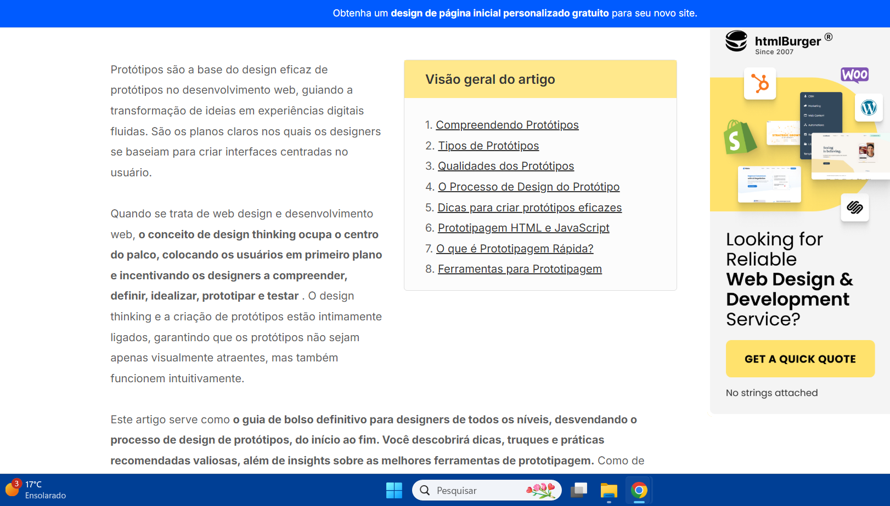

# Protótipo — Ryan Salles

## Função dos autores

| Nome                                               | Função                                                                              | 
|----------------------                              |----------------------------------------------------------------                     |
|[João Pedro Costa](https://github.com/johnaopedro)  | Revisão Geral, Construção do modelo de documento                                    | 
|[Ryan Salles](https://github.com/RA-Salles)         | Criação dos protótipos, adaptação do modelo para uso com protótipos chatbot e Voz   |

    Autor(es): 
    <a href="https://github.com/johnaopedro" target="_blank">João Pedro Costa</a>

## Introdução

A prototipagem é uma técnica utilizada no processo de engenharia de requisitos e design de sistemas para representar, de forma visual e/ou funcional, aspectos de um sistema antes de sua implementação completa. De acordo com Bruton (UX Design Institute), o protótipo atua como um artefato intermediário entre a especificação de requisitos e o desenvolvimento, permitindo validar funcionalidades, fluxos de interação e regras de negócio com os stakeholders. Já Boicheva (2024) reforça que a prototipagem é essencial para detectar inconsistências, ambiguidade e requisitos incompletos, antecipando problemas que poderiam surgir nas fases posteriores do ciclo de vida do software.

## Tipos

Os principais tipos de protótipos são classificados de acordo com o seu nível de fidelidade e interatividade:  
**Protótipos de baixa fidelidade:** são representações simplificadas, como desenhos em papel, focadas na estrutura e navegação. Não apresentam lógica de negócio nem interações reais, sendo úteis nas etapas iniciais de elicitação e validação de requisitos.  

**Protótipos de média fidelidade:** incluem elementos gráficos mais definidos e alguma interatividade simulada. São usados para revisar a experiência do usuário, fluxo de tarefas e regras básicas de navegação.  

**Protótipos de alta fidelidade:** são quase funcionais, com interfaces próximas da versão final e comportamentos interativos, simulando o funcionamento real do sistema. Servem para validação precisa de requisitos funcionais e não funcionais, testes com usuários e até como referências para desenvolvedores.  
A escolha do tipo de protótipo depende do objetivo da prototipagem, da fase do projeto e do nível de maturidade dos requisitos. Em contextos de engenharia de software, a prototipagem contribui diretamente para a redução de retrabalho, melhora da comunicação entre equipes técnicas e usuários, e aumento da qualidade dos requisitos especificados.

## Telas do Protótipo

### Descrição das Telas

#### 1. Tela Inicial
A tela inicial apresenta ao usuário as principais opções do sistema de forma clara e objetiva.

#### 2. Botão de Voz
Esse é um botão que sempre estará presente nas telas do protótipo e permite que o usuário realize comandos utilizando 
sua voz:

- **Botão "Voz":** Inicia captação da voz para processamento e subsequente comando.

#### 3. Tela de ajuda
A tela de ajuda é um local para ajuda centralizada no aplicativo, por onde seria possível 
que o usuário obtivesse ajuda no uso do aplicativo:

- **Ajuda Textual**: Ajuda rápida já presente no aplicativo original movida para a sessão de ajuda.
- **Consulta Rápida**: Acesso ao chatbot.

#### 4. Tela do Chatbot "Consulta Rápida"
A tela de chat possibilita a comunicação direta entre usuário e atendente. Os principais componentes são:

- **Área de mensagens:** exibe o histórico da conversa.
- **Campo de texto:** permite digitar novas consultas.
- **Botão "Enviar":** envia a mensagem digitada.
- **Botão "Voz"":** Compatibilidade com a assistência por voz
- **Indicação de status do atendente:** mostra se o chatbot está elaborando uma resposta.

Essas telas foram projetadas para garantir uma navegação intuitiva e facilitar o acesso às principais funcionalidades do sistema.

---

## Imagens do Protótipo

### Tela Inicial

    

### Protótipos Chatbot e Assistência por Voz

**Autor:** [Ryan Salles](https://github.com/RA-Salles)  
**Funcionalidade:** Assistência por Voz e Chatbot    
**Rastreabilidade:** [RF26](../../elicitacao/requisitos_elicitados.md), [RF37](../../elicitacao/requisitos_elicitados.md)    
**Ferramentas:** Figma    
**Tipo:** Alta Fidelidade   

### Chatbot e Assistência por Voz

    

---
## Validação

A validação dos protótipos foi realizada presencialmente. As informações da reunião presencial são apresentadas nas tabelas a seguir.

### Tabela 1: Informações da Entrevista

| Campo   | Informação                                               |
| :-----: | :------------------------------------------------------: |
| Local   | [UnB - FCTE](https://maps.app.goo.gl/f8bxb23JLZJpw7REA)  |
| Data    | 05/06/2025                                               |
| Horário | 12:20                                                    |
| Duração | Cerca de 5 minutos                                       |

    Autor(es): 
    <a href="https://github.com/RA-Salles" target="_blank">Ryan Salles</a>

  

### Tabela 2: Participantes da Entrevista

| Nome                                                | Função                      |
| :------------------------------------------:        | :----------------------:    |
| Artur                                               | Usuário/ Project Owner      |
| [Ryan Salles](https://github.com/RA-Salles)         | Entrevistador/Desenvolvedor |
| [Gabriel Flores](https://github.com/Gabrielfcoelho) | Secretário/Observador       |

    Autor(es): 
    <a href="https://github.com/RA-Salles" target="_blank">Ryan Salles</a>

### Vídeo da Validação

<iframe width="560" height="315" src="https://www.youtube.com/embed/2iyPLe9E0C0?si=ETIPSJEdEnaQp1DI" title="YouTube video player" frameborder="0" allow="accelerometer; autoplay; clipboard-write; encrypted-media; gyroscope; picture-in-picture; web-share" referrerpolicy="strict-origin-when-cross-origin" allowfullscreen></iframe>

    Autor(es): 
    <a href="https://github.com/RA-Salles" target="_blank">Ryan Salles</a>

---

## Bibliografia
>BRUTON, L. A complete guide to prototyping - UX Design Institute. Disponível em: <https://www.uxdesigninstitute.com/blog/prototyping-guide/>.

    

>BOICHEVA, S. What is Prototype Design? [Guide 2024]. Disponível em: <https://htmlburger.com/blog/prototype-design/>.

    

---

## Histórico de versão
| Versão |    Data    |    Descrição                                       |         Autor                                      |       Revisor                                      |
| :----: | :--------: | :--------------:                                   | :-------------------:                              | :----------------:                                 |
|  1.0   | 01/07/2025 | Desenvolvimento do modelo de documento             | [João Pedro Costa](https://github.com/johnaopedro) | [Ryan Salles](https://github.com/RA-Salles)        |
|  1.1   | 06/07/2025 | Modificação do modelo para uso com outro protótipo | [Ryan Salles](https://github.com/RA-Salles)        | [João Pedro Costa](https://github.com/johnaopedro) |
