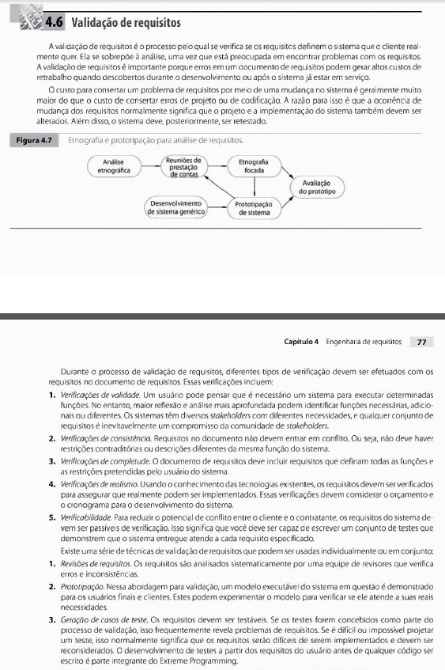
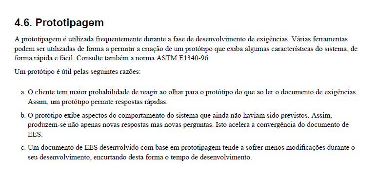
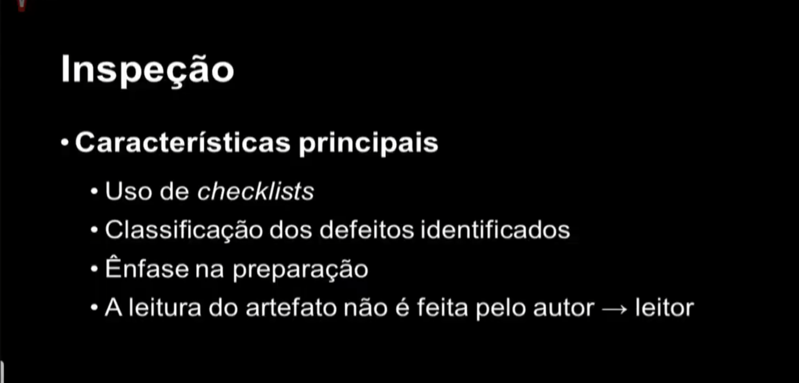
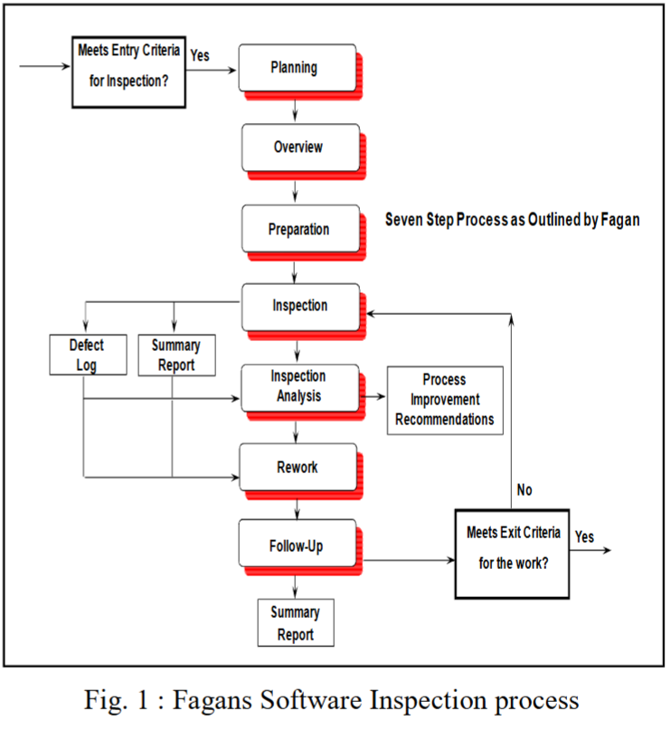

# Lista de Verificação - Entrega 5

## Introdução

Este documento apresenta uma lista de verificação criada para o [Grupo 4](https://github.com/Requisitos-de-Software/2025.1-Cadastro-Unico) e o Grupo+1 ([Grupo 5](https://github.com/Requisitos-de-Software/2025.1-IBGE))
referente a **Etapa 5** do projeto, com o objetivo de garantir que os artefatos iniciais estejam de acordo com os requisitos e especificações estabelecidas.
 
O checklist foi sugerido pelo professor André Barros de Sales como uma ferramenta prática para confirmar que todas as etapas estão cumpridas corretamente antes
de avançar para as fases seguintes.

## Funções dos autores

<strong>Tabela 1:</strong> Funções dos autores no artefato

| Nome                                              | Função                                                                  | 
|---------------------------------------------------|-------------------------------------------------------------------------|
| [Ryan Salles](https://github.com/RA-Salles)       | Criação do documento, inserção de informações base, manutenção          |
| [João Pedro](https://github.com/johnaopedro)      | Revisão Geral, Itens de Desenvolvimento do Projeto                      |
| [Amanda Cruz](https://github.com/mandicrz)        | Itens de Desenvolvimento do Projeto                                     |

    Autor(es): 
    <a href="https://github.com/johnaopedro" target="_blank">João Pedro Costa</a>

## Checklist como Método de Verificação

O **checklist**, que significa **Lista de Verificação**, uma técnica importante durante a revisão das etapas do projeto, ajudando a garantir que cada parte esteja em conformidade com os requisitos estabelecidos. Para validar a eficácia e a completude do checklist, utilizaremos a técnica de **inspeção**, que consiste em uma revisão sistemática para verificar a clareza, relevância e aplicabilidade de cada item listado, tanto do nosso grupo quanto do grupo avaliado. Seu principal objetivo é:

- Identificar possíveis erros em qualquer parte do projeto.
- Verificar se o projeto atende aos requisitos especificados.
- Assegurar que o trabalho foi feito conforme os padrões e diretrizes definidas pelo professor.
- Garantir consistência e uniformidade.
- Facilitar o gerenciamento do projeto tornando-o mais organizado e controlado.

## Checklists - Entrega 5

As Tabelas 2 e 3 apresentam checklists para os elementos de desenvolvimento do projeto e conteúdo da disciplina, respectivamente, presentes no GitPages, garantindo que as etapas e os requisitos técnicos sejam atendidos de acordo com o **Plano de Ensino** do professor.

### Desenvolvimento do Projeto

<strong>Tabela 2:</strong> Checklist de Desenvolvimento do Projeto

| **ID** |                       **Item**                       |                                        **Referência**                                             | **Autor(es)**      |                
| :----: | :--------------------------------------------------: | :-------------------------------------------------------------------------------------------:     | :-------:          |                 
|  DS01  |         Padronização do Histórico de Versão          | SALES, André Barros de. Plano de Ensino, RE-012025, Turma 3.                                      | João Pedro, Amanda |               
|  DS02  |          Autor e revisor para cada artefato          | SALES, André Barros de. Plano de Ensino, RE-012025, Turma 3.                                      | João Pedro, Amanda |               
|  DS03  | Referências e/ou bibliografia em todos os artefatos  | SALES, André Barros de. Plano de Ensino, RE-012025, Turma 3.                                      | João Pedro, Amanda |               
|  DS04  |    Legenda e fonte em todas as imagens e tabelas     | SALES, André Barros de. Plano de Ensino, RE-012025, Turma 3.                                      | João Pedro, Amanda |               
|  DS05  |          Introdução do texto dos artefatos           | SALES, André Barros de. Plano de Ensino, RE-012025, Turma 3.                                      | João Pedro, Amanda |               
|  DS06  | Cronograma executado além do inicialmente planejado  | SALES, André Barros de. Plano de Ensino, RE-012025, Turma 3.                                      | João Pedro, Amanda |               
|  DS07  |                  Atas das reuniões                   | SALES, André Barros de. Plano de Ensino, RE-012025, Turma 3.                                      | João Pedro, Amanda |               
|  DS08  |                Gravação das reuniões                 | SALES, André Barros de. Plano de Ensino, RE-012025, Turma 3.                                      | João Pedro, Amanda |               
|  DS09  | Upload de apresentação no YouTube como não "listado" | SALES, André Barros de. Plano de Ensino, RE-012025, Turma 3.                                      | João Pedro, Amanda |               

    Autor(es): <a href="https://github.com/mandicrz" target="_blank">Amanda Cruz</a>, <a href="https://github.com/johnaopedro" target="_blank">João Pedro Costa</a>

---

### Conteúdo da Disciplina

<strong>Tabela 3:</strong> Checklist de Conteúdo da Disciplina - Prototipagem e Validação

| **ID** |                       **Item**                                                          |                                        **Referência**                                                                          | **Autor**                          |
| :----: | :------------------------------------------------------------------------------------:  | :-------------------------------------------------------------------------------------------:                                  | :--------------------------------: |
| CD01	 | O objetivo do protótipo está claramente definido                                        | PRESSMAN, Roger S.; MAXIM, Bruce R. Software Engineering: A practitioner's approach. Nova Iórque: McGraw-Hill Education, 2020. | Ryan                               |   
| CD02	 | O protótipo apresenta a fonte com base em requisitos funcionais e não funcionais        | GONÇALVES, André et. al. IEEE Std 830                                                                                          | Ryan, João Pedro                   | 
| CD03	 | O protótipo foi construído com base nas necessidades e perfil dos usuários finais       | SOMMERVILLE, Ian. Engenharia de Software. 9. ed.                                                                               | Ryan                               | 
| CD04	 | O nível de fidelidade do protótipo (baixa, média, alta) é adequado à fase do projeto    | BOICHEVA, S. What is Prototype Design?                                           	                                            | Ryan, Julia                        |  
| CD05   | O protótipo foi validado com usuários, clientes ou stakeholders                         | SOMMERVILLE, Ian. Engenharia de Software. 9. ed.                                                                               | Ryan                               | 
| CD06   | O protótipo permite que o cliente e/ou stakeholder valide o software em desenvolvimento | SOMMERVILLE, Ian. Engenharia de Software. 9. ed.                                                                               | Ryan                               | 

    Autor(es): 
    <a href="https://github.com/RA-Salles" target="_blank">Ryan Salles</a>

<strong>Tabela 3:</strong> Checklist de Conteúdo da Disciplina - Verificação 

| **ID** |                       **Item**                                                         |                                        **Referência**                                                                          | **Autor**                          |
| :----: | :------------------------------------------------------------------------------------: | :-------------------------------------------------------------------------------------------:                                  | :--------------------------------: |
| CD07	 | Os papeis dos participantes foram definidos antes da reunião                           | BARHATE, B. H. Software Inspection Improves Quality of Software Product                                                        | Ryan                               |   
| CD08	 | A reunião passou por um processo de planejamento                                       | SIQUEIRA, Fábio Levy. Gerência e Qualidade de Software - Aula 06 - Técnica de revisão                                          | Ryan                               | 
| CD09	 | O planejamento incluiu a construção de uma lista de verificação                        |	SIQUEIRA, Fábio Levy. Gerência e Qualidade de Software - Aula 06 - Técnica de revisão                                          | Ryan                               | 
| CD10	 | Os defeitos encontrados foram documentados                                             |	SOMMERVILLE, Ian. Engenharia de Software. 9. ed.                                                                               | Ryan                               |  

    Autor(es): 
    <a href="https://github.com/RA-Salles" target="_blank">Ryan Salles</a>

---

## Bibliografia

As Figuras 1 a 9 apresentam a bibliografia utilizadas para a construção dessa lista de verificação.

> SALES, André Barros de. Plano de Ensino, RE-012025, Turma 3. Disponível em: <https://aprender3.unb.br/pluginfile.php/3106711/mod_resource/content/55/Lista%20de%20Verifificac%CC%A7a%CC%83o%20-%20Plano_de_Ensino%20RE%20012025%20Turma%2003%20v1.pdf>. Acesso em: 01 junho 2025.

<strong>Figura 1:</strong> Lista de Verificação - Desenvolvimento (DS01 - DS09)

<strong>Fonte:</strong> adaptado de SALES (2025)

---

> SOMMERVILLE, Ian. Engenharia de Software. 9. ed. São Paulo: Pearson, 2011, p. 74-75. Disponível em: https://www.facom.ufu.br/~william/Disciplinas%202018-2/BSI-GSI030-EngenhariaSoftware/Livro/engenhariaSoftwareSommerville.pdf

<strong>Figura 2:</strong> Sommerville sobre a validação

<strong>Fonte:</strong> adaptado de SOMMERVILLE (2011)

<strong>Figura 3:</strong> Sommerville sobre inspeções

    

<strong>Fonte:</strong> adaptado de SOMMERVILLE (2011)

---

>BRUTON, L. A complete guide to prototyping - UX Design Institute. Disponível em: <https://www.uxdesigninstitute.com/blog/prototyping-guide/>.

<strong>Figura 4:</strong> Bruton sobre prototipagem

    

<strong>Fonte:</strong> adaptado de BRUTON (2025)

---

>BOICHEVA, S. What is Prototype Design? [Guide 2024]. Disponível em: <https://htmlburger.com/blog/prototype-design/>.

<strong>Figura 5:</strong> BOICHEVA sobre a prototipação

    

<strong>Fonte:</strong> adaptado de BOICHEVA (2025)

---

> GONÇALVES, André et. al. IEEE Std 830. Disponível em: <https://professor.pucgoias.edu.br/sitedocente/admin/arquivosUpload/17785/material/IEEE830.pdf>. Acesso em: 22 de Junho de 2025.

<strong>Figura 6:</strong> Padrão IEEE 830

<strong>Fonte:</strong> adaptado de GONÇALVES

---

> SIQUEIRA, Fábio Levy. Gerência e Qualidade de Software - Aula 06 - Técnica de revisão. 2018. Disponível em: < https://youtu.be/nA1BVDd9GUE >. Acesso em: 20/06/2025.

<strong>Figura 7:</strong> Siqueira sobre inspeções

    

<strong>Fonte:</strong> adaptado de SIQUEIRA (2018)

---

> BARHATE, B. H. Software Inspection Improves Quality of Software Product. *International Journal of Computer Science & Informatics*, Vol.- II, Issue-1, 2. 2013. [Link para o artigo](../../assets/referencias/inspecao_fagan/Software_Inspection_Improves_Quality_of_Software_P.pdf)

<strong>Figura 8:</strong> Diagrama elaborado por Barhate apresentando o processo de inspeção e suas fases.

    

<strong>Fonte:</strong> adaptado de BARHATE (2013)

---

> PRESSMAN, Roger S.; MAXIM, Bruce R. Software Engineering: A practitioner's approach. Nova Iórque: McGraw-Hill Education, 2020. 

<strong>Figura 9:</strong> Pressman e Maxim sobre a prototipação.

<strong>Fonte:</strong> adaptado de PRESSMAN e MAXIM (2020).

---

## Histórico de Versão

| Versão |    Data    |    Descrição                                                                             |         Autor                                      |       Revisor                                      |
| :----: | :--------: | :--------------:                                                                         | :-------------------:                              | :----------------:                                 |
| 1.0    | 01/06/2025 | Criando a pagina                                                                         | [João Pedro Costa](https://github.com/johnaopedro) | [Ryan Salles](https://github.com/RA-Salles)        |
| 1.1    | 05/07/2025 | Adaptação do artefato para a entrega 5                                                   | [Ryan Salles](https://github.com/RA-Salles)        | [João Pedro Costa](https://github.com/johnaopedro) |
| 2.0    | 07/07/2025 | Manutenção das referências, adição de autores aos itens, itens de inspeção mais robustos | [Ryan Salles](https://github.com/RA-Salles)        | [João Pedro Costa](https://github.com/johnaopedro) |